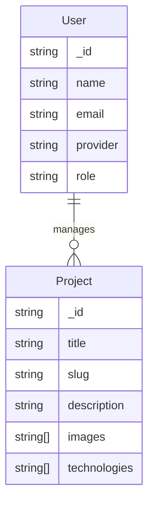
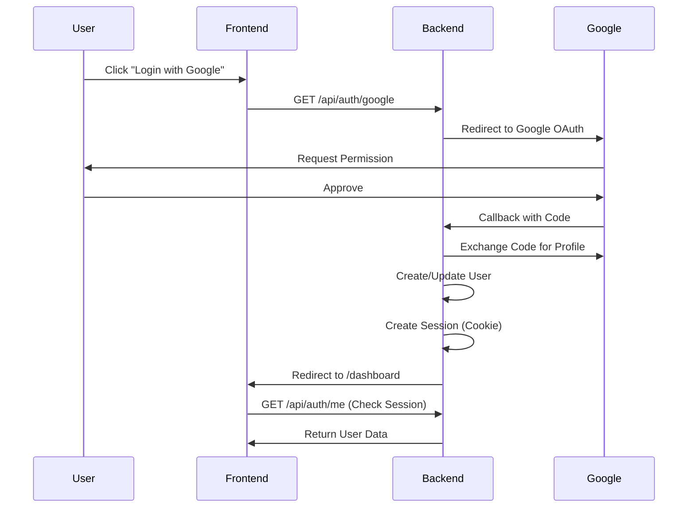
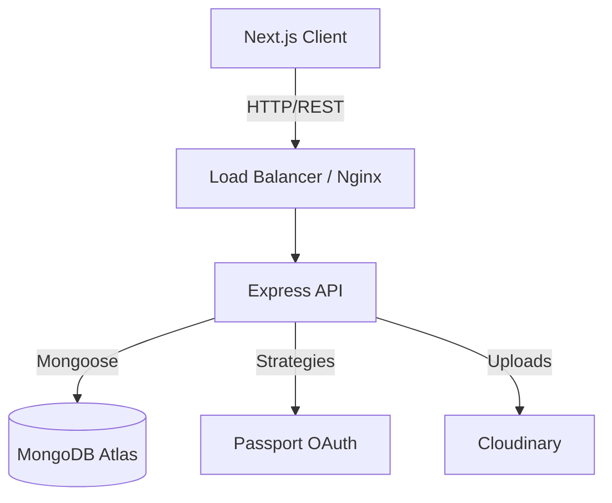

# System Architecture & Diagrams

## ER Diagram

```mermaid
erDiagram
    User ||--o{ Project : manages
    User {
        string _id
        string name
        string email
        string provider
        string role
    }
    Project {
        string _id
        string title
        string slug
        string description
        string[] images
        string[] technologies
    }
```

## Authentication Flow (OAuth2)

```mermaid
sequenceDiagram
    participant User
    participant Frontend
    participant Backend
    participant Google

    User->>Frontend: Click "Login with Google"
    Frontend->>Backend: GET /api/auth/google
    Backend->>Google: Redirect to Google OAuth
    Google->>User: Request Permission
    User->>Google: Approve
    Google->>Backend: Callback with Code
    Backend->>Google: Exchange Code for Profile
    Backend->>Backend: Create/Update User
    Backend->>Backend: Create Session (Cookie)
    Backend->>Frontend: Redirect to /dashboard
    Frontend->>Backend: GET /api/auth/me (Check Session)
    Backend->>Frontend: Return User Data
```

## API Architecture

```mermaid
graph TD
    Client[Next.js Client]
    LB[Load Balancer / Nginx]
    API[Express API]
    DB[(MongoDB Atlas)]
    Auth[Passport OAuth]
    Cloud[Cloudinary]

    Client -->|HTTP/REST| LB
    LB --> API
    API -->|Mongoose| DB
    API -->|Strategies| Auth
    API -->|Uploads| Cloud
```
